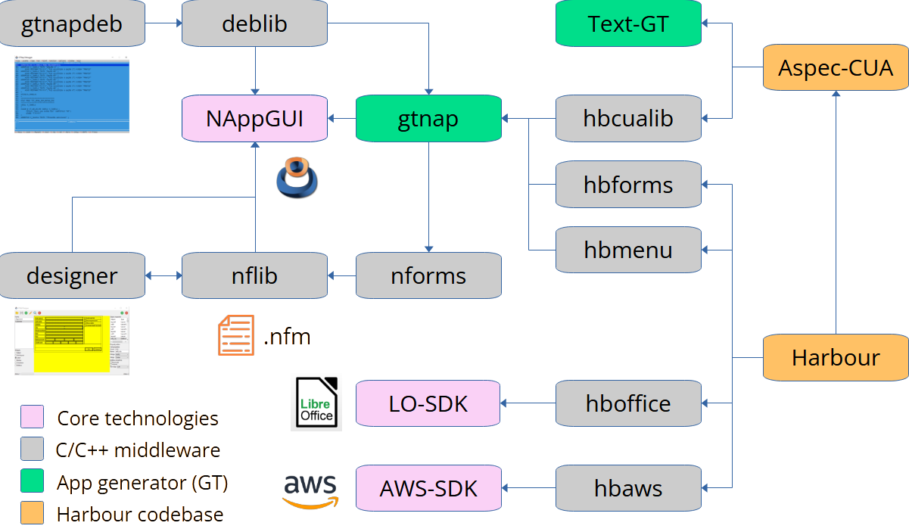

# GTNAP Stack. Strategy plan.

In the initial planning of [GTNAP-Forms-Designer](./plan.md), 38 sprints were estimated to be required to have a first operational version of the tool. After 16 sprints, we reviewed the current project status project and rethink the future actions.

## Timeline

- Sprint 1/62: The main app skeleton.
- Sprint 2/63: First data structures. Recursive Layout drawing.
- Sprint 3/66: Add Label widget. Add sublayouts. Begin property editor.
- Sprint 4/67: Object inspector. Property editor.
- Sprint 5/68: Add Button, CheckBox, EditBox, Column-width, Row-height.
- Sprint 6/69: Serialization: Save/Read from files.
- Sprint 7/70: First Harbour integration.
- Sprint 8/71: Merge into `master`. Linux, macOS. Documentation.
- Sprint 9/72: TextView. `min-width` property.
- Sprint 10/74: ImageView. Load images. Binarize images for canvas.
- Sprint 11/75: Multiline labels, Slider, ProgressBar.
- Sprint 12/76: Dynamic menus (I).
- Sprint 13/77: Dynamic menus (II).
- Sprint 14/78: PopUp and ListBox.
- Sprint 15/79: Working in NAppGUI kernel: Resizing algorithms.
- Sprint 16/80: TableView. Harbour working areas.

## Current tech stack

- `gtnap`: Library that generates the NAP general terminal. Allow create a desktop application that runs on Windows, Linux and macOS. It offers three bindings with Harbour language:
    - `hbcualib`: Connector for support the Aspec-CUALIB semigraphic environment.
    - `hbforms`: Support for `.nfm` files with formulary design. Total freedom in widget positions and sizes. Allow all standard widgets: Label, Button, PopUp, TableView, Image, TextView, Slider, etc.
    - `hbmenu`: Support for dynamic menus (menubar, popup) with icons and submenus.

- `nflib`: Library that supports the NAppGUI-Forms data model. It contains the editable data from which we can generate a form. It allows model serialization to generate `.nfm` files. Currently, it is a binary format, but it is possible to create a parallel text format for direct editing (not planning yet). This library also allows create the GUI runtime form from a file on disk.

- `nforms`: Library that allows to query the `.nfm` model at runtime. For example, to retrieve a specific widget or data binding from controls to variables in memory (or vice versa).

- `designer`: Graphical application that allows to design forms in a visual way and save them in `.nfm` format.

- `deblib`: Implementation of debugging protocol that allows to use the Harbour debugger in a GTNAP graphics application.

- `gtnapdeb`: Application that shows the Harbour debugger in a GTNAP graphics applications. Uses the `deblib` protocol and recreate the standard debugger text interface.

- `hboffice`: A library that defines high-level operations on LibreOffice documents, simplifying use and providing a binding to Harbour. It implements only a small subset of LibreOffice, allowing it to continue to grow and adapt to new requirements.

- `hbaws`: Library that defines high-level operations on AWS, implementing a binding to Harbour. Currently, it defines certain operations on the S3 service, but can be expanded to meet new requirements.

- `NAppGUI`: C API that allows to create cross-platform graphical applications. It acts as a small layer that unifies native technologies: Win32, GTK3, and Cocoa. It evolves separately, and the copy of NAppGUI embedded in GTNAP is regularly updated.

- `LibreOffice-SDK`: Library that allows to create and edit LibreOffice documents using C++.

- `AWS-SDK`: C++ library that allows to access the AWS API through code. It's very complex, but eliminates the need to manually manage HTTP requests to Amazon servers.

> Important: In a single application written in Harbour you can combine all the stack: `GTNAP/Cualib`, `GTNAP/Forms`, `GTNAP/Dynamic menus`, `HBOFFICE`, `HBAWS`.

 ## Future actions

