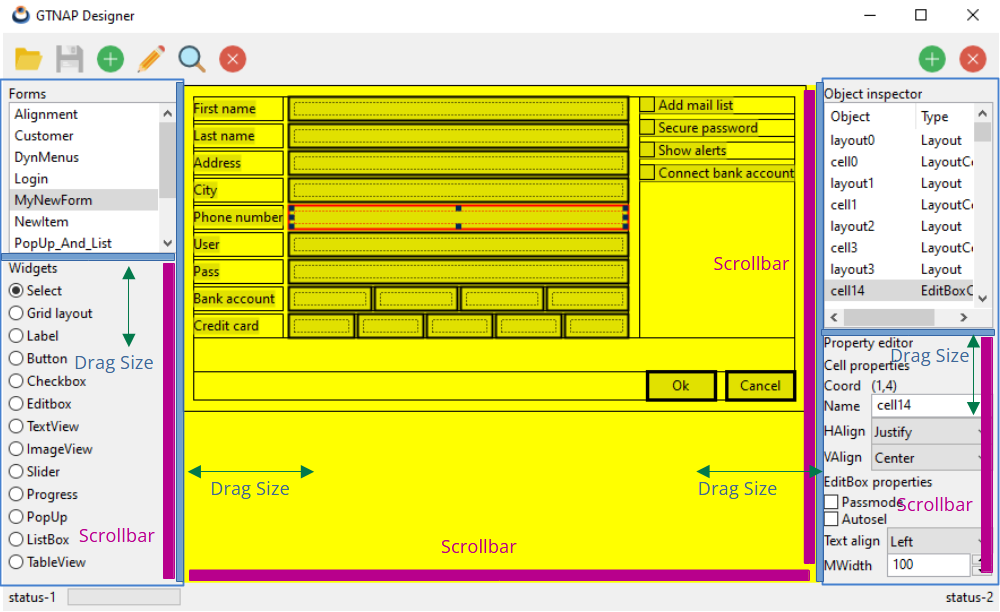
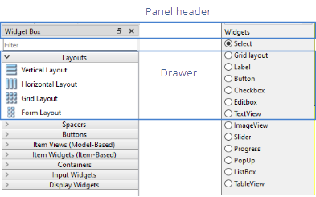
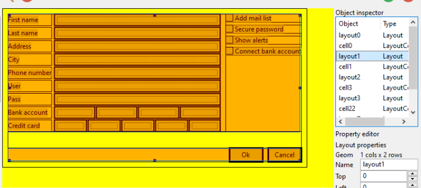
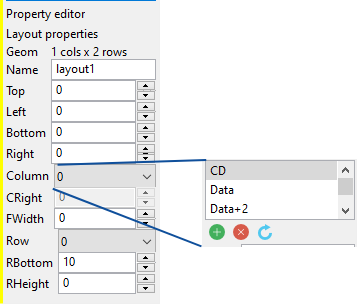
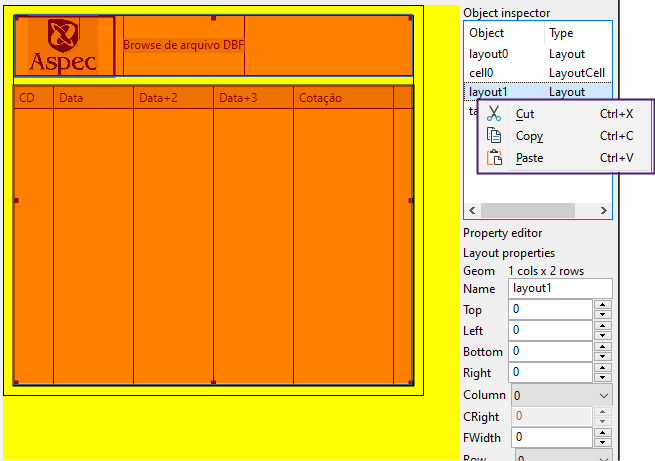
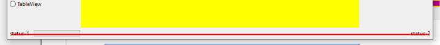

# GTNAP Designer. Strategy plan.

In the initial planning of [GTNAP-Forms-Designer](./plan.md), **38** sprints were estimated to be required to have a first operational version of the tool. After 16 sprints, we reviewed the current project status project and rethink the future actions.

## Designer timeline

- Sprint 1/62: The main app skeleton.
- Sprint 2/63: First data structures. Recursive Layout drawing.
- Sprint 3/66: Add Label widget. Add sublayouts. Begin property editor.
- Sprint 4/67: Object inspector. Property editor.
- Sprint 5/68: Add Button, CheckBox, EditBox, Column-width, Row-height.
- Sprint 6/69: Serialization: Save/Read from files.
- Sprint 7/70: First Harbour integration.
- Sprint 8/71: Merge into `master`. Linux, macOS. Documentation.
- Sprint 9/72: TextView. `min-width` property.
- Sprint 10/74: ImageView. Load images. Binarize images for canvas.
- Sprint 11/75: Multiline labels, Slider, ProgressBar.
- Sprint 12/76: Dynamic menus (I).
- Sprint 13/77: Dynamic menus (II).
- Sprint 14/78: PopUp and ListBox.
- Sprint 15/79: Working in NAppGUI kernel: Resizing algorithms.
- Sprint 16/80: TableView. Harbour working areas.

## Current tech stack

- `gtnap`: Library that generates the NAP general terminal. Allow create a desktop application that runs on Windows, Linux and macOS. It offers three bindings with Harbour language:
    - `hbcualib`: Connector for support the Aspec-CUALIB semigraphic environment.
    - `hbforms`: Support for `.nfm` files with formulary design. Total freedom in widget positions and sizes. Allow all standard widgets: Label, Button, PopUp, TableView, Image, TextView, Slider, etc.
    - `hbmenu`: Support for dynamic menus (menubar, popup) with icons and submenus.

- `nflib`: Library that supports the NAppGUI-Forms data model. It contains the editable data from which we can generate a form. It allows model serialization to generate `.nfm` files. Currently, it is a binary format, but it is possible to create a parallel text format for direct editing (not planning yet). This library also allows create the GUI runtime form from a file on disk.

- `nforms`: Library that allows to query the `.nfm` model at runtime. For example, to retrieve a specific widget or data binding from controls to variables in memory (or vice versa).

- `designer`: Graphical application that allows to design forms in a visual way and save them in `.nfm` format.

- `deblib`: Implementation of debugging protocol that allows to use the Harbour debugger in a GTNAP graphics application.

- `gtnapdeb`: Application that shows the Harbour debugger in a GTNAP graphics applications. Uses the `deblib` protocol and recreate the standard debugger text interface.

- `hboffice`: A library that defines high-level operations on LibreOffice documents, simplifying use and providing a binding to Harbour. It implements only a small subset of LibreOffice, allowing it to continue to grow and adapt to new requirements.

- `hbaws`: Library that defines high-level operations on AWS, implementing a binding to Harbour. Currently, it defines certain operations on the S3 service, but can be expanded to meet new requirements.

- `NAppGUI`: C API that allows to create cross-platform graphical applications. It acts as a small layer that unifies native technologies: Win32, GTK3, and Cocoa. It evolves separately, and the copy of NAppGUI embedded in GTNAP is regularly updated.

- `LibreOffice-SDK`: Library that allows to create and edit LibreOffice documents using C++.

- `AWS-SDK`: C++ library that allows to access the AWS API through code. It's very complex, but eliminates the need to manually manage HTTP requests to Amazon servers.

> Important: In a single application written in Harbour you can combine all the stack: `GTNAP/Cualib`, `GTNAP/Forms`, `GTNAP/Dynamic menus`, `HBOFFICE`, `HBAWS`.

## Next Steps

GTNAP-Designer already offers basic functionality for creating forms and integrating them into end-user Harbour applications. We propose the following improvements.

### Designer UX

Improve the usability and appearance of the design application:

- Internal resize of drawing area and tool windows, using drag controls (SplitView). Now, these panels are static and fixed-size.
    - Left drag to increase the left-side tools.
    - Right drag to increase the right-side tools.
    - Top-down drag to relative size of `Forms` and `Widgets` panels.
    - Top-down drag to relative size of `Object Inspector` and `Property Editor` panels.

- Scrollbars in the canvas. If the panel under construction is larger than the visible area, it should be able to move it.

- Vertical scrollbar in `Widgets` and `Property Editor` panels. They currently have a considerable fixed height and will grow in the future.

- Panel header and drawers. Tool panels need a header. They should also implement sections or drawers to show or hide certain parts of the panel. **Important:** At the moment, the panel headers will not incorporate "dockerizable" or "drag and drop" functionality. They will be fixed in their location.

    

### Widget Box

Organize widgets in drawers. Radiobuttons will be replaced by **temporary** icons. The definitive icons of the application will be designed at the end of the project.

- **Drawer 0:** (no drawer) Select.

- **Drawer 1:** Layouts
    - Vertical Layout (**new**).
    - Horizontal Layout (**new**).
    - Grid Layout (**current**).

- **Drawer 2:** Buttons
    - Push button (**current**).
    - Tool button (**new**).
    - Radio button (**new**).
    - CheckBox (**current**).

- **Drawer 3:** Text Widgets
    - Label (**current**).
    - EditBox (**current**).
    - ComboBox (**new**).
    - TextView (**current**).

- **Drawer 4:** Item Widgets
    - ListBox (**current**).
    - PopUp (**current**).
    - TableView (**current**).

- **Drawer 5:** Other Widgets
    - ImageView (**current**).
    - Horizontal Slider (**current**).
    - Vertical Slider (**new**).
    - ProgressBar (**current**).

### Forms Toolbox

The forms panel will be left as it is. The shows all existing forms in the work directory and allows to alternate with each other without the need to open and close files.

- Add a "form" icon next to the filename.

### Object inspector

This panel is important and its operation is different from other similar tools (such as _QtDesigner_). It does not show all the hierarchy of the form, which would do it "little inituitive" and "massive", due to the large number of elements. It shows "the sublayout path" from the original layout to the currently selected cell. This panel can be enhanced to help the user navigate the layout/cell that is editing.

- The "object" and "type" columns must be resizable.
- An icon with the cellType will be shown near the object name.
- If a layout is selected, the layout area will be shaded over the canvas, highlighting the columns, rows and margins.
- If a cell is selected, the parent layout will be shaded (as previous option), but changing the color of selected cell.

    

### Property editor

- Organize properties in drawers.
    - Layout properties: Name, Border, Column, Row.
    - Cell properties: Name, Alignment.
    - Label properties.
    - Button properties.
    - Edit properties.
    - ...

### Layout management

Currently, the size of the layout (rows/columns) is defined when created and cannot be changed. Adding or removing elements dynamically will greatly improve editing capabilities.

- Add/remove layout columns.
- Add/remove layout rows.

    

### Clipboard

Right-click on a cell or on an element of the `Object Inspector` will show a popup menu with the typical clipboard options: Copy, Paste, Cut.

- Copy the content of a cell (widget or sublayaut) to the clipboard.
- Paste, in an empty cell, the content of the clipboard (widget or sublayaut).
- Remove the content of a cell, copying it to the clipboard.
    

### Menu and toolbar

### Canvas

### Status bar

The status bar has no apparent utility and will be removed.

- Remove the status bar from the main window.
    

### Discarded functionality

## Sprint detail

- Sprint 17: UX - SplitViews (drag size) and scrollbars. Remove statusbar.
- Sprint 18: UX - Panel headers and drawer implementation.
- Sprint 19: WidgetBox - Vertical + horizontal layout. Layout property editor.
- Sprint 20: WidgetBox - Toolbutton + RadioButton.
- Sprint 21: WidgetBox - ComboBox.
- Sprint 22: WidgetBox - TableView (improvement) and vertical slider.
- Sprint 23: Forms Toolbox, Menu and Toolbars.
- Sprint 24: Object Inspector. Columns, icons and canvas shading.
- Sprint 25: Property editor. Organize layouts/widgets properties into drawers.
- Sprint 26: Property editor (and II).
- Sprint 27: Layout management. Add/remove columns/rows.
- Sprint 28: Clipboard. Copy, paste, cut cell content.

## Fuera

- Vertical scrollbar in `Widgets` panels. It currently has a considerable fixed height and will grow in the future.

- Improve the usability of GTNAP-Designer. Currently, although functional, the application's design is very crude. We will improve the user experience in the following Sprints.

- Designer Layout: Form list, Widget selector, Object inspector, property editor. Añadir barras de scroll a cada panel y SplitViews con el fin de poder modificar el tamaño relativo respecto a la ventana principal.

- Mejorar el canvas: Implementar el clipping gráfico en NAppGUI, para poder recortar elementos de dibujo (imágenes, columnas, etc).

- Copy/Paste: Posibilidad de copiar el contenido de una celda (widget o sublayout) y pegarla en una celda vacía.

- Undo/Redo:

- Funcionalidades no implementadas de momento.
    - Drag 'n' drop (postpuesta).
    - Multiple seleccition (postpuesta).

### Wizard CUA

GTNAP-Designer provides a layout-based design system, which greatly simplifies the placement and sizing of widgets. However, it is far from the ease of use provided by CUALIB, as it is a very high-level interface that allows forms to be generated from just a few lines of code. Although GTNAP-Designer offers detailed control over form aesthetics, we should consider a more high-level tool rather than using GTNAP-Designer directly.

The CUA Wizard will deploy a series of configurable templates with just a few clicks.

### Dockable UI

### Improve the CUA model

- Option 1: CUALIB 2.0: Extend the CUALIB library to take advantage of the graphical capabilities of modern GUIs, completely decoupling text terminals and character-based coordinates.

- Option 2: Define templates (Wizards) that automatically generate .nfm files, instead of having to create them "from scratch," which would involve a lot of repetitive work.

### Improve the GTNAP-Designer user experience

### Old/modern CUALIB code cohexistence

### Needs

## Next actions

Since Aspec applications are based on the CUA (_Common User Access_) methodology, future actions to be carried out on the GTNAP project will be aimed at integrating the current Aspec code base (based on CUALIB) with the new forms methodology, based on `.nfm` files generated with GTNAP-Designer.
