# NAppGUI designer

* [Designer overview](#napdesigner-overview)
* [Build Designer](#build-napdesigner)
* [Inspect demo forms](#inspect-demo-forms)
* [Create a new form](#create-a-new-form)
    - [Space subdivision. Adding cells](#space-subdivision-adding-cells)
    - [Adding widgets](#adding-widgets)
    - [Margins, alignments and sizes](#margins-alignments-and-sizes)
* [Cut, Copy, Paste](#cut-copy-paste)
* [Undo, Redo](#undo-redo)
* [Save, Export](#save-export)
* [Simulate Forms](#simulate-forms)
* [Resizable Forms](#resizable-forms)
* [Property editor list](#property-full-list)
    - [Layout properties](#layout-properties)
    - [Cell properties](#cell-properties)
    - [Push Button properties](#push-button-properties)
    - [Check Box properties](#check-box-properties)
    - [Radio Button properties](#radio-button-properties)
    - [Tool Button properties](#tool-button-properties)
    - [Label properties](#label-properties)
    - [Edit Box properties](#edit-box-properties)
    - [Combo Box properties](#combo-box-properties)
    - [Text View properties](#text-view-properties)
    - [List Box properties](#list-box-properties)
    - [PopUp Button properties](#popup-button-properties)
    - [Table View properties](#table-view-properties)
    - [Image View properties](#image-view-properties)
    - [Custom View properties](#custom-view-properties)
    - [Scroll View properties](#scroll-view-properties)
    - [Horizontal Slider properties](#horizontal-slider-properties)
    - [Vertical Slider properties](#vertical-slider-properties)
    - [Progress Bar properties](#progress-bar-properties)


NAppGUI Designer is a visual tool for creating user interfaces (forms) graphically and interactively. These forms will be saved in files that can be loaded at runtime from Harbour, using HBNAP. It has been developed using NAppGUI-SDK and the forms it generates also use NAppGUI to run within the final application (https://nappgui.com).

## Designer overview

In principle, the appearance of the application is very similar to that of other similar tools (QTDesigner, for example). In the central part we will have the design area where we view the form under construction. On the left we have a list of files and a widget selector. On the right we have the object inspector and the properties editor. At the top we will see the typical toolbar for file management and a status bar at the bottom.

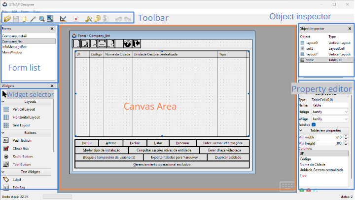

## Build Designer

Designer is distributed as part of GTNAP, so you don't have to do anything special to compile it, just run the build script in `contrib\gtnap`. More information in [Build GTNAP](../Readme.md#build-gtnap)

```
cd contrib/gtnap

:: Windows MinGW
build.bat -b [Debug|Release] -comp mingw64

:: Linux/macOS
bash ./build.sh -b [Debug|Release]
```
The application executable can be found at `build/[Debug|Release]/bin/napdesign`, just run it.

## Inspect the demo forms

The first time the application starts we will have a blank drawing area and all the buttons are off. To make a first contact, it is recommended to open the example forms. Designer loads all existing ones in the same folder. Click `Open Forms` button (📁) and select `/contrib/gtnap/tests/cuademo/forms`. We can see the current folder path by placing the mouse over the icon. By clicking on any file, we will select it and see it in the drawing area.

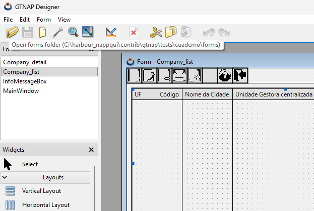

## Create a new form

> **Important:** NAppGUI is based on the concept of Layout (GridLayout in QtDesigner) which will divide the space into a grid of **ncols** x **nrows** cells. The difference with other SDKs is that NAppGUI **does not support floating elements**. All widgets must be inside a cell in a layout. As we will see below, the main advantage of this `Layout->Sublayout->Cell->Widget` relationship is that **it is not necessary to set the frame** (position and size) of each element, since it will be automatically calculated by NAppGUI based on the native API (Win32, GTK, Cocoa).

Press `[Add new form]`, set the name and description. You will see in the canvas area that a small form has been created with a blank interior region. This is the first cell (or root cell) where we can place a single widget.

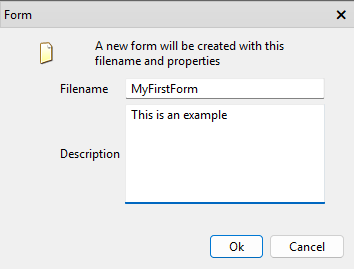

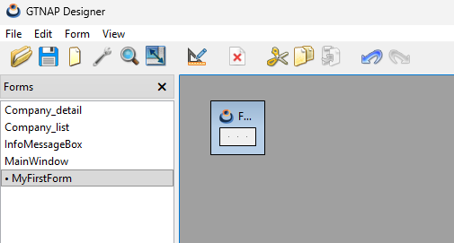

Before starting to place components, we will have to think about the structure of the form. The ideal is to make a small sketch on paper or a mental diagram. As a first example, let's recreate the `Company_detail` form.

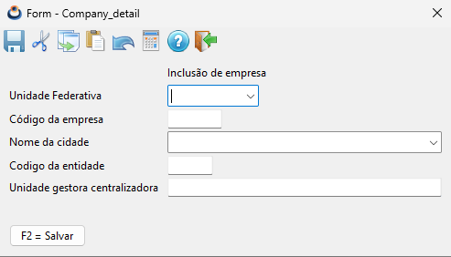

### Space subdivision. Adding cells

Looking at our form to replicate, we identify a vertical organization composed of three areas: Toolbar, Data Entry and Action Buttons. We create this structure with 3 cells.

* Click _Vertical Layout_ in the _Widget Selector_. This will mark the widget.

* Click inside the only cell within the form on the canvas. A box will appear where we indicate 3 rows.

    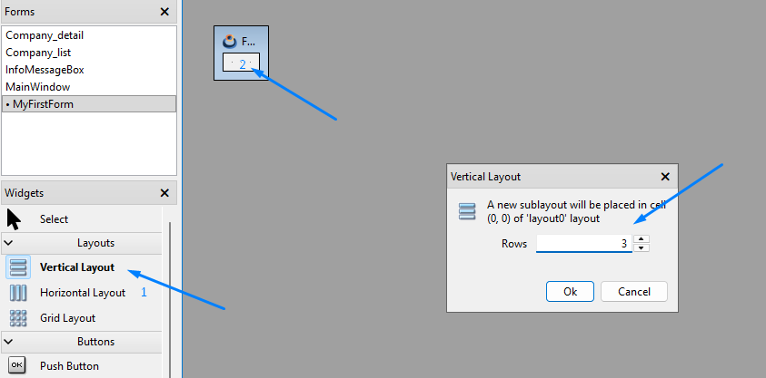

    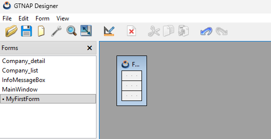

Our initial root cell has become a stack of three vertical cells. We continue creating spaces for the toolbar.

* Click _Horizontal Layout_ in the _Widget Selector_.

* Click inside the TOP cell within the form on the canvas. A box will appear where we indicate 8 columns.

    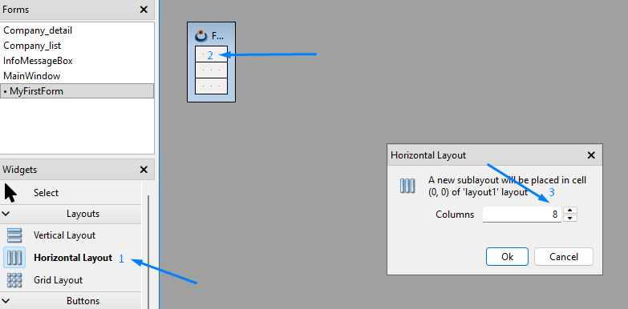

    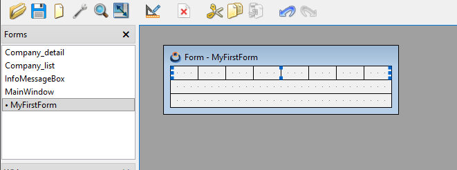

For the central data area we will need a 2x6 cell grid.

* Click _Grid Layout_ in the _Widget Selector_.

* Click inside the MIDDLE cell within the form on the canvas. A box will appear where we indicate 2 columns and 6 rows.

    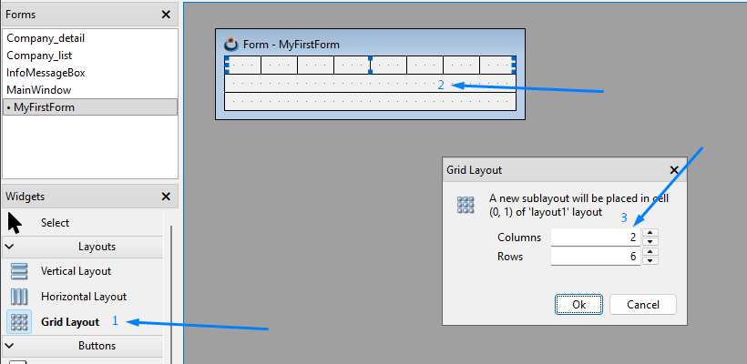

    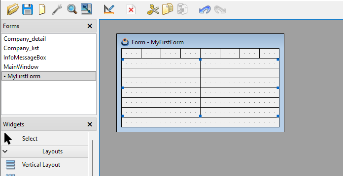

Since we are only going to place one button in the Action Buttons area (bottom area), it is not necessary to continue subdividing the form space.

### Adding widgets

Once we have the structure of the form, we are going to add the widgets, starting with the toolbar.

* Click _Tool button_ in the _Widget Selector_.

* Click in the top-left cell. A box will appear.

* Click `Load icon` button and select `contrib/gtnap/test/cuademo/forms/icons/salvar.png`.

    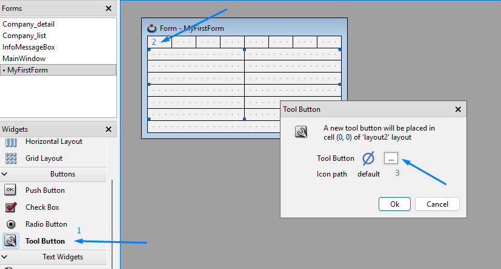

    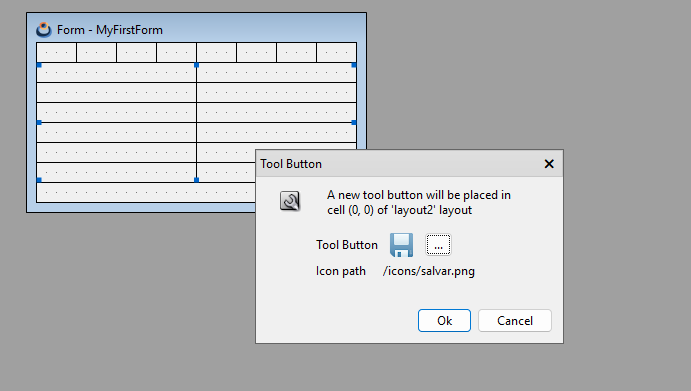

    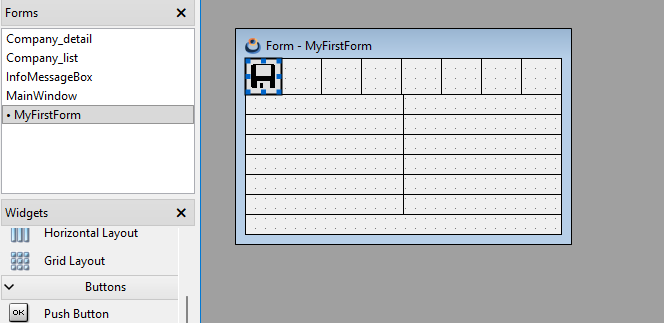

> **Important:** As you can see, when you add widgets to the cells, they are resized to accommodate the control (the toolbutton image in this case). This resizing propagates recursively to the rest of the neighboring cells, affecting the total size of the form.

> **Important:** When we associate resources to controls (mostly images) the relative path from the location of the form to the location of the resource is stored (`/icons/salvar.png` in this case).

* We repeat the process for the remaining seven buttons on the toolbar.

    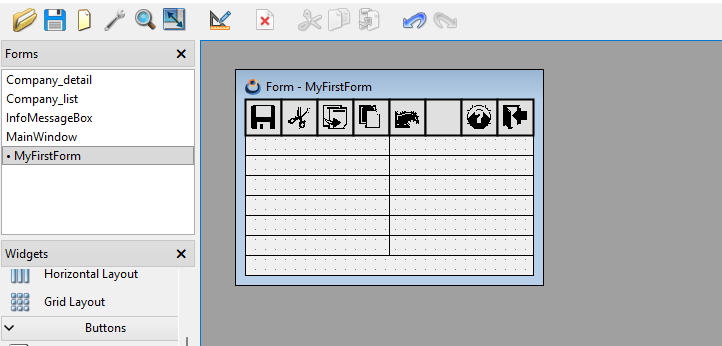

* We continue through the entry data area. Click on _Label_ in the _Widget Selector_.

* Click on the free upper right cell. In the text box we type `Inclusão de empresa`.

    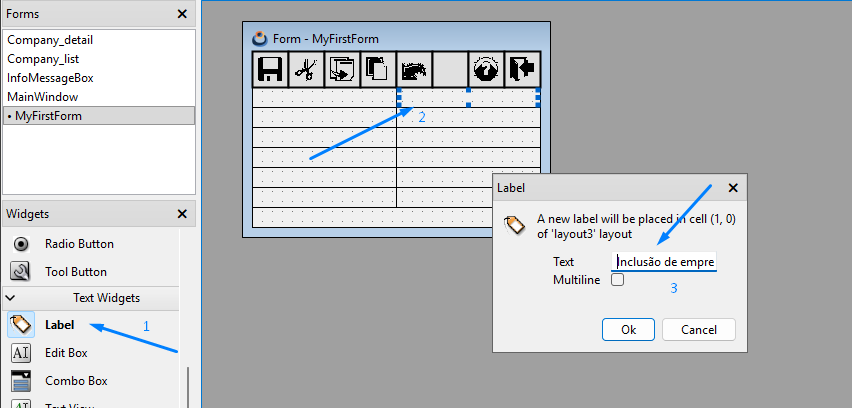

    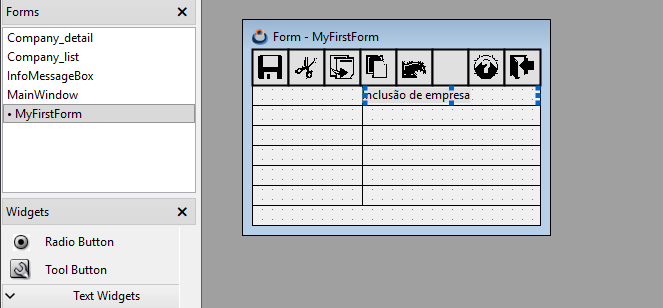

* We repeat the operation for the rest of the texts in the left column:

    - `Unidade Federativa`.
    - `Código da empresa`.
    - `Nombre da cidade`.
    - `Código da entidade`.
    - `Unidade gestora centralizadora`.

    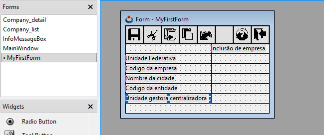

* Now let's add the text editing boxes and combo box. Click on _Combo Box_ in the _Widget Selector_.

* Click on the free cell at the top right.

* We select a size of 100px for the combo.

    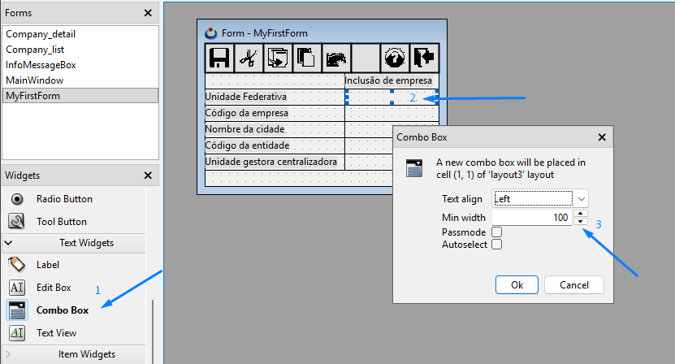

    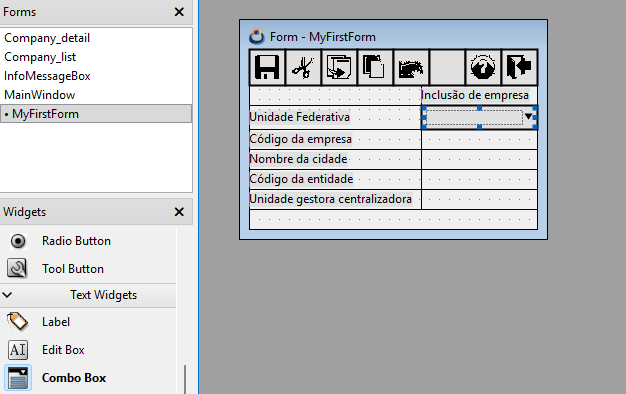

* Now, click _Edit Box_ in the _Widget Selector_.

* Click on the free upper right cell.

* We select a size of 60px.

    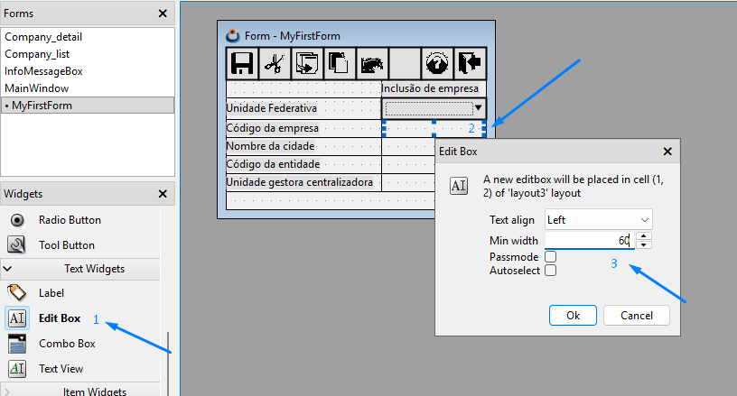

    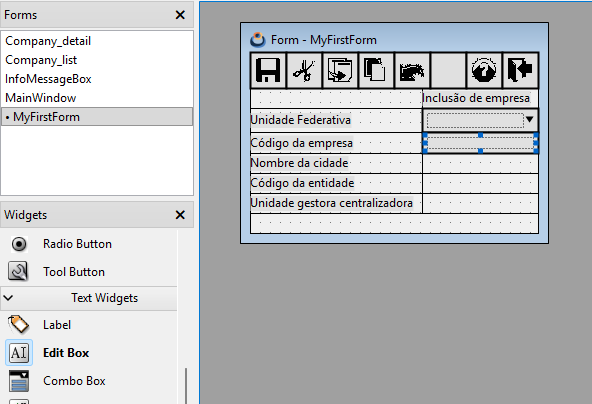

> **Important:** We see that, although we have indicated 60px, the Edit Box measures 100px. This is because, by default, the cell containing an Edit Box has horizontal expansion by default. We will return to this later.

* We finish the text input block:

    - `Nombre da cidade`: Combo Box 100px.
    - `Código da entidade`: Edit Box 50px.
    - `Unidade gestora centralizadora`: Edit Box 300px.

    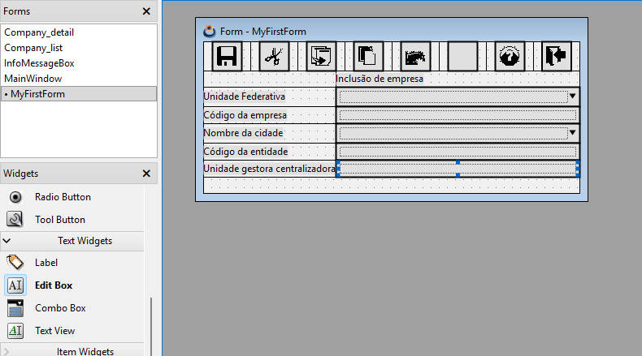

> **Important:** As we have already indicated, despite having introduced different measurements, all text controls have been expanded horizontally to the width of the width (300px).

* To finish, let's add the push button. Click _Push Button_ on the _Widget Selector_.

* Click on the bottom empty cell.

* In the dialog we write `F2 = Save` as the button text.

    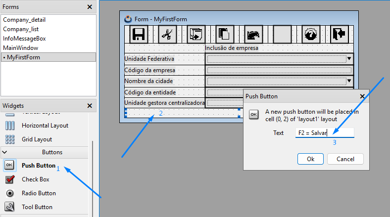

    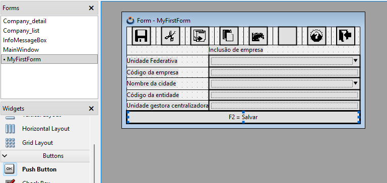

> **Important:** Buttons (and other text-based controls, such as _Label_) are automatically sized based on the text they contain. However, Push Button cells also expand automatically.

* We have already completed the basic layout of the form. If we press the button (🔍) `Simulate Form` we can launch the form.

    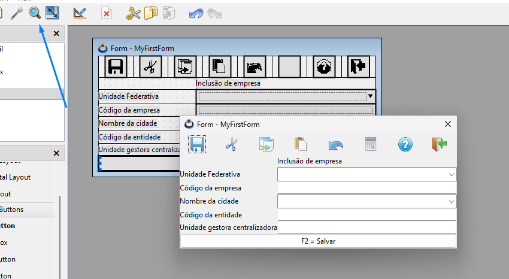

### Margins, alignments and sizes

While our form is fully functional, it is not very aesthetic. Let's give it some formatting to improve its appearance.

* We start by aligning the Toolbar to the left. We click on the first button of the toolbar on the canvas.

* After clicking, the _Object inspector_ provides us with the "path" from the original cell to the toolbutton, passing through the hierarchy of intermediate cells and sublayouts.

* Click on `cell1` which identifies the cell that contains the entire _Horizontal Grid_ of the toolbar.

* In _Property Editor_ `Cell Properties`, `HAling::Left`.

    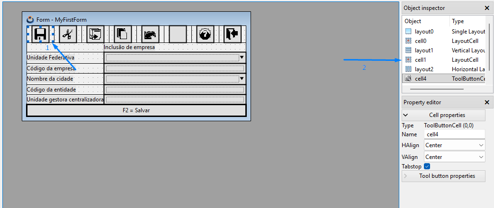

    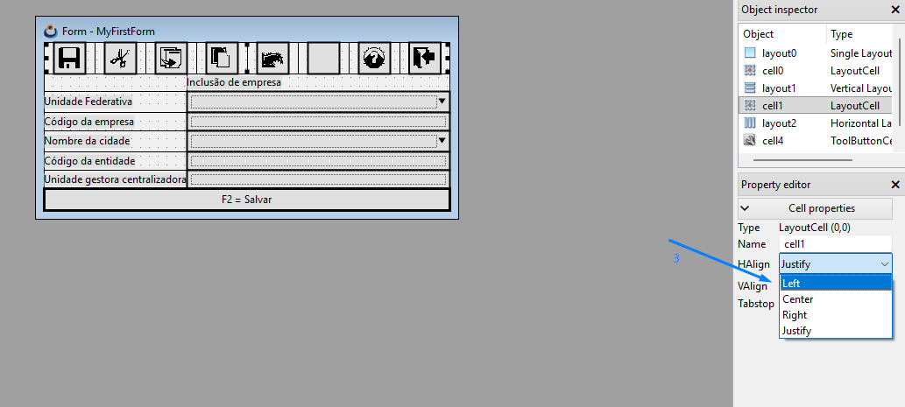

    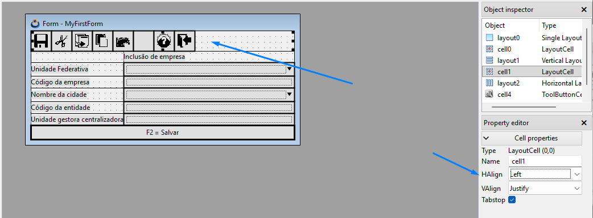

> **Important:** The _Horizontal Grid_ containing the buttons can exactly calculate its dimensions based on the widgets it contains. But since the form has been widened underneath, it expands (default behavior) leaving an unwanted separation between buttons. What we have done is identify this cell (which contains the entire _Horizontal Layout_) with left alignment.

* Let's do something similar with the text controls. Click on the first _Combo Box_.

* In _Property Editor_ `Cell Properties`, `HAling::Left`.

    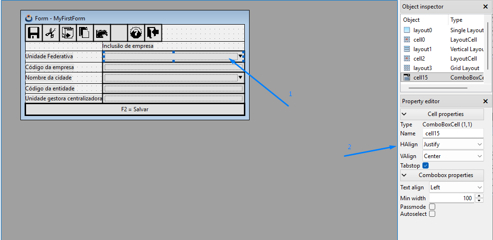

    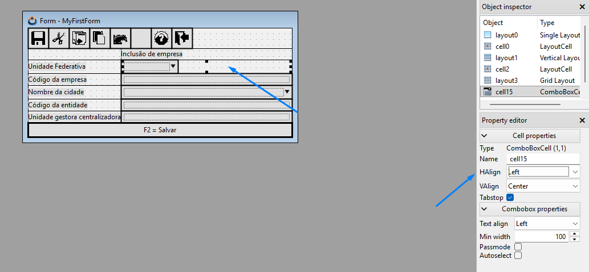

* Now we see the original size that we assigned to the control (100 px), before it was expanded.

* We set `HAling::Left` for all text controls and for the _Push Button_.

    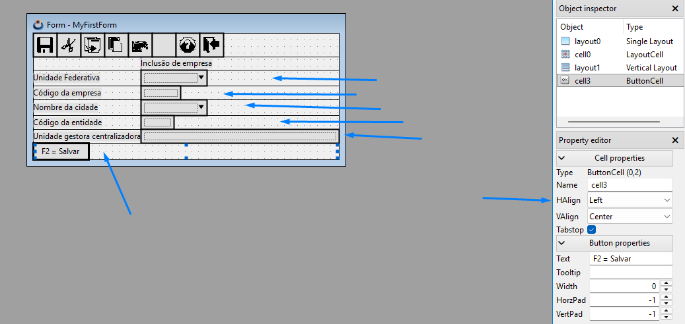

> **Important:** The last _Edit Box_ (`Unidade gestora centralizada`), being the widest (300px), it does not matter whether we select `Left` or `Justify` alignment. We will obtain the same effect.

* Let's now work on the margins and spacing of the interior data area.

* Click on the _Label_ `Inclusão de empresa`. Then click on the _Object Inspector_ on the top item (`layout3::Grid Layout`). With this we will have the 2x6 Grid Layout in _Property Editor_.

    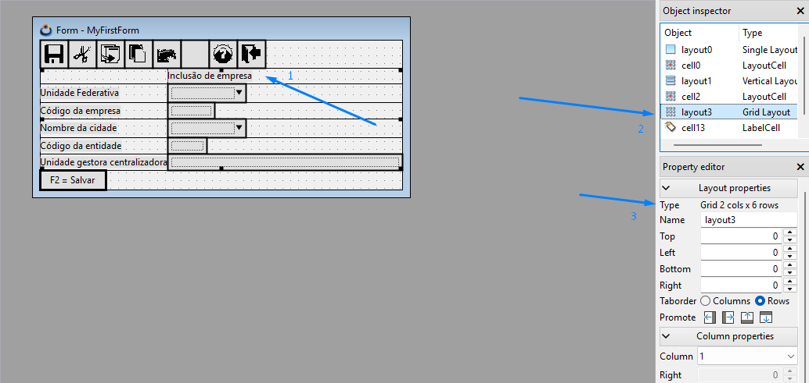

* In _Layout Properties_ set `10` in the `Left` and `Right` fields. We observe that a separation of 10px is established on both sides of the 2x6 _Grid_.

    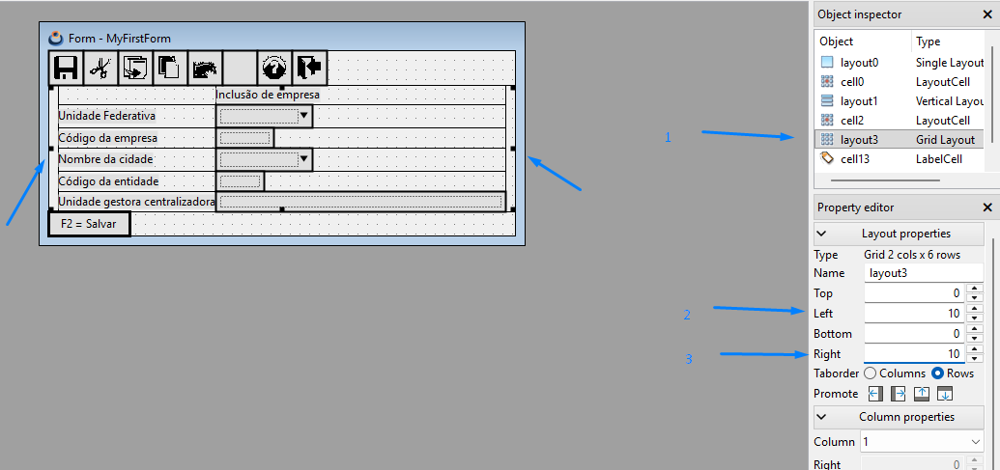

> **Important:** By setting the margins the entire form has grown, since otherwise it is impossible to guarantee the size restrictions of widgets and spaces.

* We continue in _Layout Properties_ of the 2x6 Grid. We select `Column 0` and then `Right 10`. This will establish a separation between columns 0 and 1 of the grid (the _Label_ and _Edit/Combo Box_).

    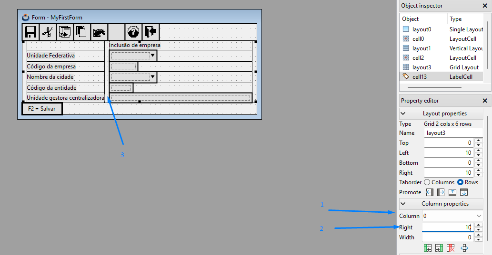

* In the same way, in _Layout Properties_ of the 2x6 Grid, we select `Row 0` and then `Bottom 3`. We repeat for `Row 1`, `Row 2`, `Row 3` and `Row 4`.

    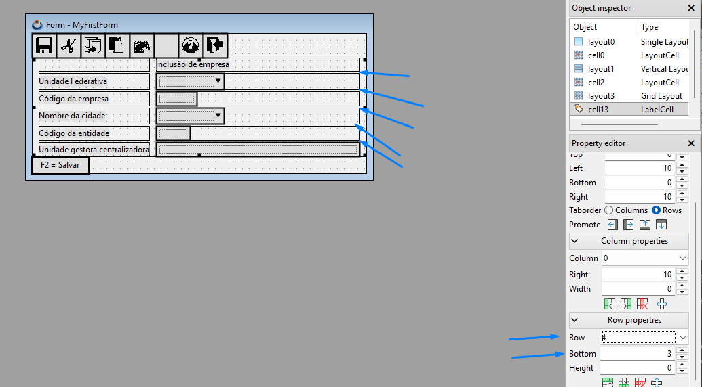

> **Important:** We will not be able to set the `Right/Bottom` properties of the last `Column/Row` of the layout. Interior margins are not considered. Use the `Right/Bottom` properties of the layout.

* Now we are going to leave some space between the 2x6 Grid and the Toolbar and the action button. We could do it perfectly using the `Top/Bottom` properties of the _Layout Properties_, but we are going to do it another way.

* Click on any control on the form. In _Object Inspector_ select _Vertial Layout_ 1x3. This is the main layout that contains the stack with the three parts of the form (toolbar, edit area and button area). Now we go to `Row 0` and `Bottom 10`. We see the separation between the first two cells of the main stack.

    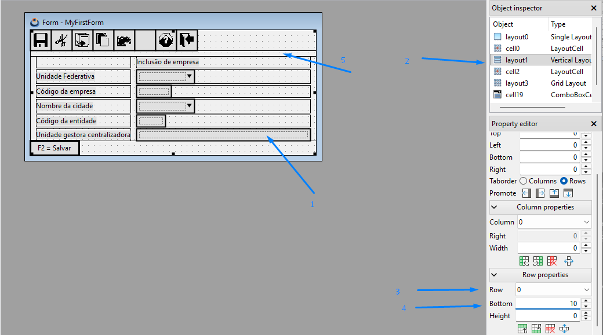

* After `Row 1` and `Bottom 30`. We see a larger space between the edit area and the button area.

    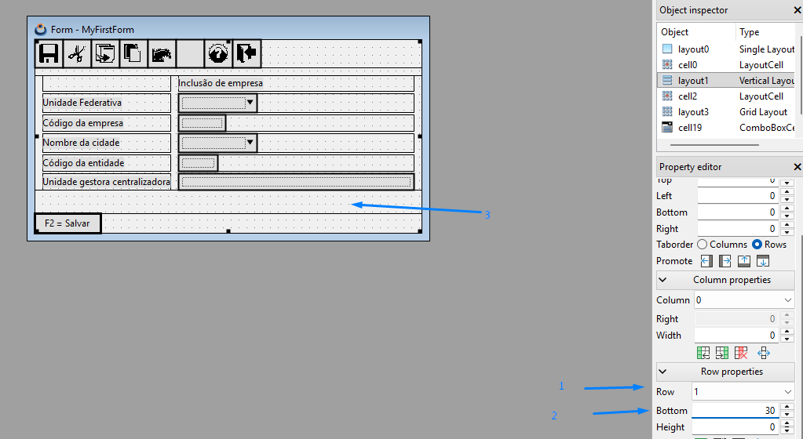

* Finally, we are going to give a small left-bottom separation to the action button, since it has remained very close to the edge of the window. Because the button has been linked directly to the last cell of the _Vertical Grid_ we do not have the margin properties of a sublayout (Layout left margin and others). We will, therefore, use the interior padding, which are properties of each cell.

* Click on the action button `F2 = Salvar`.

* In _Property Editor_, `Cell properties`. After `Left: 10`, `Bottom: 10`.

    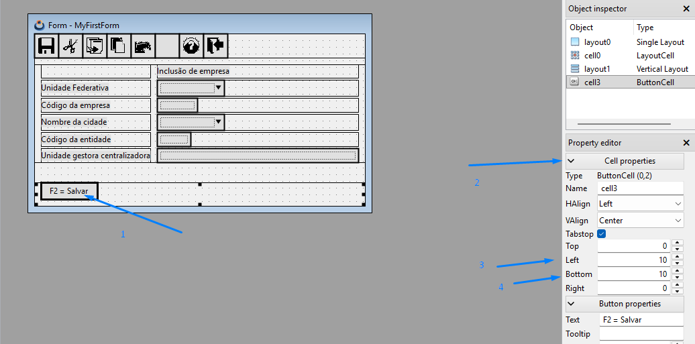

> **Important:** We can achieve the same visual results with different combinations of Layout margins and Cell paddings.

> **Important:** Layout margins properties are available in both the main layout (grid) and sublayouts (subgrids).

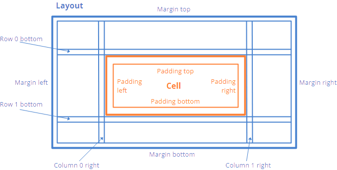

## Simulate Forms

* As we have already seen in previous steps, we can interact with the form under construction, at any time, using the `Simulate Form` (🔍) button or menu option.

    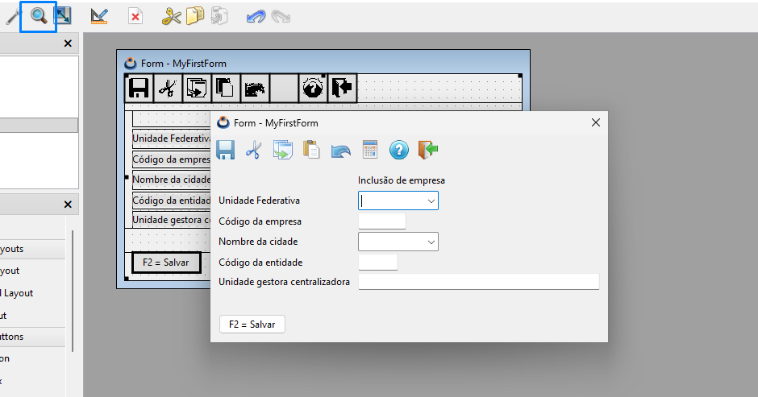

## Add/remove columns and rows

## Promote layouts

## Cut, Copy, Paste

## Undo, Redo

## Save, Export

## Resizable Forms

## Property full list

In the _Property Editor_ panel we can change the value of the element properties. Any changes will automatically be reflected in the canvas and simulation.

### Layout properties

Layouts are rectangular grids (columns x rows) where we can place elements (widgets). More information in the [official NAppGUI documentation](https://nappgui.com/en/gui/layout.html).

- **Name:** Layout name. Useful to access the element at run time.

- **Top:** Top margin (in pixels).

- **Left:** Left margin (in pixels).

- **Bottom:** Bottom margin (in pixels).

- **Right:** Right margin (in pixels).

- **Taborder:** Columns/Rows. When we press [TAB] or [CAPS/TAB] the keyboard focus will move through the layout by rows or columns. It will only have an effect on _Grid Layout_ (m x n).

### Column properties (layout)

Within the layout we have the **Column** dropdown to select properties by column (0, m-1).

- **Right:** Inter-column space (in pixels). Disabled in the final column (`m`), because it is considered the right margin of the layout.

- **Width:** Forced column width. If it is `0` (default) the column will be automatically sized based on its components. <u>It is not recommended to use this value, except on special occasions</u>.

### Row properties (layout)

Within the layout we have the **Row** dropdown to select properties by row (0, n-1).

- **Bottom:** Inter-row space (in pixels). Disabled in the final row (`n`), because it is considered the bottom margin of the layout.

- **Height:** Forced row height. If it is `0` (default) the row will be automatically sized based on its components. <u>It is not recommended to use this value, except on special occasions</u>.

### Cell properties

For each interior element of a layout (cell), a series of properties are defined. More information in the [official NAppGUI documentation](https://nappgui.com/en/gui/cell.html).

- **Name:** Cell name. Useful to access the element at run time.

- **HAlign:** Horizontal alignment. Effective when the cell width is greater than the component size.

    * **Left:** Alignment to the left margin.

    * **Center:** Horizontally centered.

    * **Right:** Alignment to the right margin.

    * **Justify:** Horizontal expansion. The width of the element will be forced to the width of the cell.

- **VAlign:** Vertical alignment. Effective when the cell height is greater than the component size.

    * **Top:** Alignment to the top margin.

    * **Center:** Vertically centered.

    * **Bottom:** Alignment to the bottom margin.

    * **Justify:** Vertical expansion. The height of the element will be forced to the height of the cell.

- **Tabstop:** (On/Off). If `Off`, the cell will be discarded from the tablist, that is, it will not be selected when we navigate with the [TAB]/[CAPS-TAB] keyboard. By default `On`.

- **Top:** (padding). Inner separation between the top edge of the cell and the element (widget) (in pixels).

- **Left:** (padding). Inner separation between the left edge of the cell and the element (widget) (in pixels).

- **Bottom:** (padding). Inner separation between the bottom edge of the cell and the element (widget) (in pixels).

- **Right:** (padding). Inner separation between the right border of the cell and the element (widget) (in pixels).

### Push Button properties

More information in the [official NAppGUI documentation](https://nappgui.com/en/gui/button.html).

- **Text:** Text that will be displayed on the button.

- **Tooltip:** Text that will be displayed above the button when the mouse cursor is over it.

- **Width:** Forced button width. If `0` (default), the button will be automatically sized based on the text. It is not recommended to change this value.

- **HorzPad:** Inner separation between the horizontal border of the button and the text. If `-1` the default padding of each window manager will be left (recommended).

- **VertPad:** Inner separation between the vertical edge of the button and the text. If `-1` the default padding of each window manager will be left (recommended).

### Check Box properties

More information in the [official NAppGUI documentation](https://nappgui.com/en/gui/button.html).

- **Text:** Text that will be displayed to the right of the check box.

### Radio Button properties

More information in the [official NAppGUI documentation](https://nappgui.com/en/gui/button.html).

- **Text:** Text that will be displayed to the right of the radio.

### Tool Button properties

More information in the [official NAppGUI documentation](https://nappgui.com/en/gui/button.html).

- **Tooltip:** Text that will be displayed above the button when the mouse cursor is over it.

- **HorzPad:** Inner separation between the horizontal border of the button and the image. If `-1` the default padding of each window manager will be left (recommended).

- **VertPad:** Inner separation between the vertical edge of the button and the image. If `-1` the default padding of each window manager will be left (recommended).

- **Icon:** Relative path between the form location and the icon location. It cannot be changed directly, it is calculated based on the selected icon file. If we put the mouse over the button [...] we will see the complete relative path.

### Label properties

More information in the [official NAppGUI documentation](https://nappgui.com/en/gui/label.html).

- **Text:** Text displayed on the label.

- **Width:** Maximum width of the control. If it is `0` (default) the width of the control will be automatically calculated based on the text it contains.

- **Multiline:** If checked (true) the text will expand into several lines when reaching the maximum width (Width). Otherwise, the text will be cut off showing ellipses (...).

- **Align:** Horizontal interior alignment of the text, in case the Label control is wider than the text itself.

### Edit Box properties

More information in the [official NAppGUI documentation](https://nappgui.com/en/gui/edit.html).

- **TAlign:** Inside text alignment.

- **Width:** Default width of the text control. The height will be calculated automatically based on the window manager standards.

- **Passmode:** Indicates whether the control contains sensitive information. In this case it will not show the text but `(*****)`.

- **Autoselect:** Indicates whether the text will be automatically selected each time the control gains keyboard focus.

### Combo Box properties

More information in the [official NAppGUI documentation](https://nappgui.com/en/gui/combo.html).

- **TAlign:** Inside text alignment.

- **Width:** Default width of the text control. The height will be calculated automatically based on the window manager standards.

- **Passmode:** Indicates whether the control contains sensitive information. In this case it will not show the text but `(*****)`.

- **Autoselect:** Indicates whether the text will be automatically selected each time the control gains keyboard focus.

### Text View properties

More information in the [official NAppGUI documentation](https://nappgui.com/en/gui/textview.html).

- **Width:** Default width of the text control.

- **Height:** Default height of the text control.

- **Read only:** If it is checked (true) the text cannot be edited.

### List Box properties

More information in the [official NAppGUI documentation](https://nappgui.com/en/gui/listbox.html).

- **Width:** Default width of the list control.

- **Height:** Default height of the list control.

- **Elements:** List of items inside the listbox (text + optional icon). We can add/remove elements using the buttons   .

### PopUp Button properties

More information in the [official NAppGUI documentation](https://nappgui.com/en/gui/popup.html).

- **Elements:** List of items inside the popup (text + optional icon). We can add/remove elements using the buttons   .

### Table View properties

More information in the [official NAppGUI documentation](https://nappgui.com/en/gui/tableview.html).

- **Width:** Default width of the table control.

- **Height:** Default height of the table control.

- **Columns:** List of table columns. We can add/remove elements using the buttons   . The properties for each column are:

    - **Title:** Column title, displayed in the header.

    - **Align:** Column title alignment.

    - **DAlign:** Column data alignment.

    - **Width:** Column width (in pixels).

    - **Min width:** Minimum width allowed for the column (in case it is resizable).

    - **Max width:** Maximum width allowed for the column (in case it is resizable).

    - **Resizable:** If it is checked (true) it will allow the column to be resized with the mouse.

### Image View properties

More information in the [official NAppGUI documentation](https://nappgui.com/en/gui/imageview.html).

- **Width:** Default width of the image control.

- **Height:** Default height of the image control.

- **Scale:** Type of image scaling within the control:

    - **None:** No scaling. The image will be displayed centered at its original resolution. If it does not fit within the control limits, it will be clipped.

    - **Auto:** The image will be scaled to fit the dimensions of the control. Aspect ratio deformations may occur.

    - **Aspect:** The image will be scaled, but maintaining the original aspect ratio. That dimension (horz/vert) that does not match with the control dimension will be centered.

    - **Fit:** The size of the control will be automatically sized to the original size of the image, ignoring the Width/Height parameters.

- **Image:** Relative path between the form location and the icon location. It cannot be changed directly, it is calculated based on the selected icon file. If we put the mouse over the button [...] we will see the complete relative path.

### Custom View properties

More information in the [official NAppGUI documentation](https://nappgui.com/en/gui/view.html).

- **Width:** Default width of the custom control.

- **Height:** Default height of the custom control.

> **Important:** Custom Views allow you to create custom drawings/scenes and interact with them. This must be done at runtime by the application, remaining outside the scope of the Designer.

### Scroll View properties

More information in the [official NAppGUI documentation](https://nappgui.com/en/gui/view.html).

- **Width:** Default width of the custom control.

- **Height:** Default height of the custom control.

> **Important:** Like Custom Views, the drawing and management of Scrollbars must be done at runtime by the application.

### Horizontal Slider properties

More information in the [official NAppGUI documentation](https://nappgui.com/en/gui/slider.html).

- **Width:** Default width of the slider.

### Vertical Slider properties

More information in the [official NAppGUI documentation](https://nappgui.com/en/gui/slider.html).

- **Height:** Default height of the slider.

### Progress Bar properties

More information in the [official NAppGUI documentation](https://nappgui.com/en/gui/progress.html).

- **Width:** Default width of the progress bar.
