# HBNAP API

* [Introduction](#introduction)
* [Build HBNAP](#build-hbnap)
* [HBNAP Examples](#hbnap-api)
* [HBNAP Menu](#hbnap-menu)
* [UTF8 based](#utf8-based)
* [Runtime connection](#runtime-connection)
* [Data binding](#data-binding)
* [Area binding (TableView)](#area-binding-tableview)
* [HBNAP API Reference](#hbnap-api-reference)
    - [HBNAP_FORMS_LOAD](#hbnap_forms_load)
    - [HBNAP_FORMS_DESTROY](#hbnap_forms_destroy)
    - [HBNAP_FORMS_TITLE](#hbnap_forms_title)
    - [HBNAP_FORMS_SET_TEXT](#hbnap_forms_set_text)
    - [HBNAP_FORMS_SET_INT](#hbnap_forms_set_int)
    - [HBNAP_FORMS_INSERT_TEXT](#hbnap_forms_insert_text)
    - [HBNAP_FORMS_GET_INT](#hbnap_forms_get_int)
    - [HBNAP_FORMS_EMBED](#hbnap_forms_embed)
    - [HBNAP_FORMS_BIND](#hbnap_forms_bind)
    - [HBNAP_FORMS_BIND_STORE](#hbnap_forms_bind_store)
    - [HBNAP_FORMS_AREA_BIND](#hbnap_forms_area_bind)
    - [HBNAP_FORMS_AREA_REFRESH](#hbnap_forms_area_refresh)
    - [HBNAP_FORMS_AREA_RECNO](#hbnap_forms_area_recno)
    - [HBNAP_FORMS_ITEM_LIST](#hbnap_forms_item_list)
    - [HBNAP_FORMS_ONCLICK](#hbnap_forms_onclick)
    - [HBNAP_FORMS_MAXIMIZE](#hbnap_forms_maximize)
    - [HBNAP_FORMS_SHOW](#hbnap_forms_show)
    - [HBNAP_FORMS_MODAL](#hbnap_forms_modal)
    - [HBNAP_FORMS_MODAL_GTNAP](#hbnap_forms_modal_gtnap)
    - [HBNAP_FORMS_STOP_MODAL](#hbnap_forms_stop_modal)
    - [HBNAP_FORMS_CONTROL_FRAME](#hbnap_forms_control_frame)
    - [HBNAP_FORMS_UPDATE](#hbnap_forms_update)
    - [HBNAP_FORMS_MAIN_COVER](#hbnap_forms_main_cover)
* [HBNAP Menu API Reference](#hbnap-menu-api-reference)
    - [HBNAP_MENU_CREATE](#hbnap_menu_create)
    - [HBNAP_MENU_DESTROY](#hbnap_menu_destroy)
    - [HBNAP_MENU_ADD_ITEM](#hbnap_menu_add_item)
    - [HBNAP_MENU_INS_ITEM](#hbnap_menu_ins_item)
    - [HBNAP_MENU_DEL_ITEM](#hbnap_menu_del_item)
    - [HBNAP_MENU_COUNT](#hbnap_menu_count)
    - [HBNAP_MENU_GET_ITEM](#hbnap_menu_get_item)
    - [HBNAP_MENU_BAR](#hbnap_menu_bar)
    - [HBNAP_MENU_IS_MENUBAR](#hbnap_menu_is_menubar)
    - [HBNAP_MENU_POPUP](#hbnap_menu_popup)
    - [HBNAP_MENUITEM_CREATE](#hbnap_menuitem_create)
    - [HBNAP_MENUITEM_SEPARATOR](#hbnap_menuitem_separator)
    - [HBNAP_MENUITEM_SUBMENU](#hbnap_menuitem_submenu)
    - [HBNAP_MENUITEM_GET_TEXT](#hbnap_menuitem_get_text)
    - [HBNAP_MENUITEM_GET_SUBMENU](#hbnap_menuitem_get_submenu)

## Introduction

HBNAP is an API that will allow us to create cross-platform desktop applications (Windows/macOS/Linux) using Harbour. Windows/forms are designed using the [NappGUI Designer](./Designer.md) utility. The HBNAP functions are integrated into the [GTNAP](../Readme.md#introduction) library.

## Build HBNAP

HBNAP is built into GTNAP, extending its API, so we don't have to do anything special to compile it. Just run the build script in `contrib\gtnap`. More information at [Build GTNAP](../Readme.md#build-gtnap).

```
cd contrib/gtnap

:: Windows MinGW
build.bat -b [Debug|Release] -comp mingw64

:: Linux/macOS
bash ./build.sh -b [Debug|Release]
```

## HBNAP Examples

Examples in Harbour on the use of the HBNAP API can be found in [exemplohbnap.prg](../tests/cuademo/gtnap_cualib/exemplohbnap.prg) and [exemplohbnap_company.prg](../tests/cuademo/gtnap_cualib/exemplohbnap_company.prg).

To see the running examples, launch the application [Example](../Readme.md#compile-and-run-cualib-example). Then press the `HBNAP support` option and in the interactive menu press `Orçamento`. This will launch the forms implemented in the files cited above.

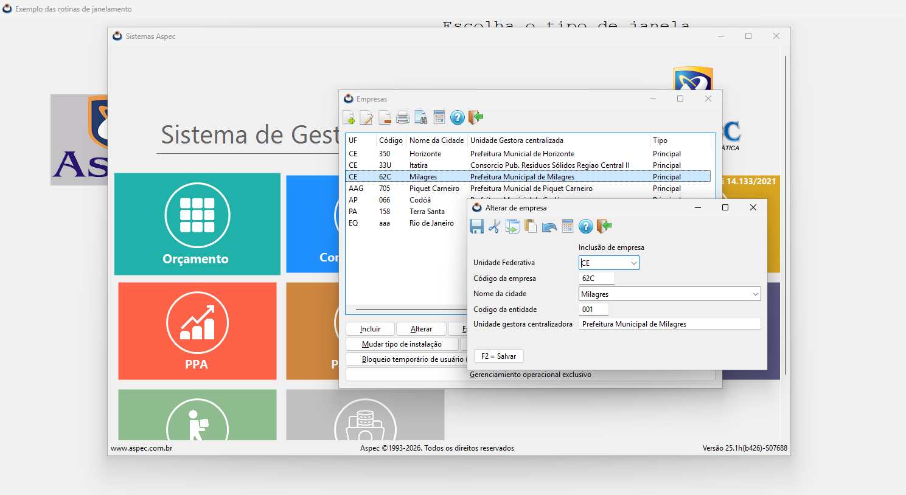

## HBNAP Menu

HBNAP provides an API to create dynamic menus and submenus at runtime. In the [Example](../Readme.md#compile-and-run-cualib-example) application, press the `HBNAP support` option and in the interactive menu press `Contábil SIAFIC (Check Menus)`. This will display an HBNAP form where you can interact with the HBNAP Menu API. You have the implementation of this example in [exemplohbnap_menu.prg](../tests/cuademo/gtnap_cualib/exemplohbnap_menu.prg).

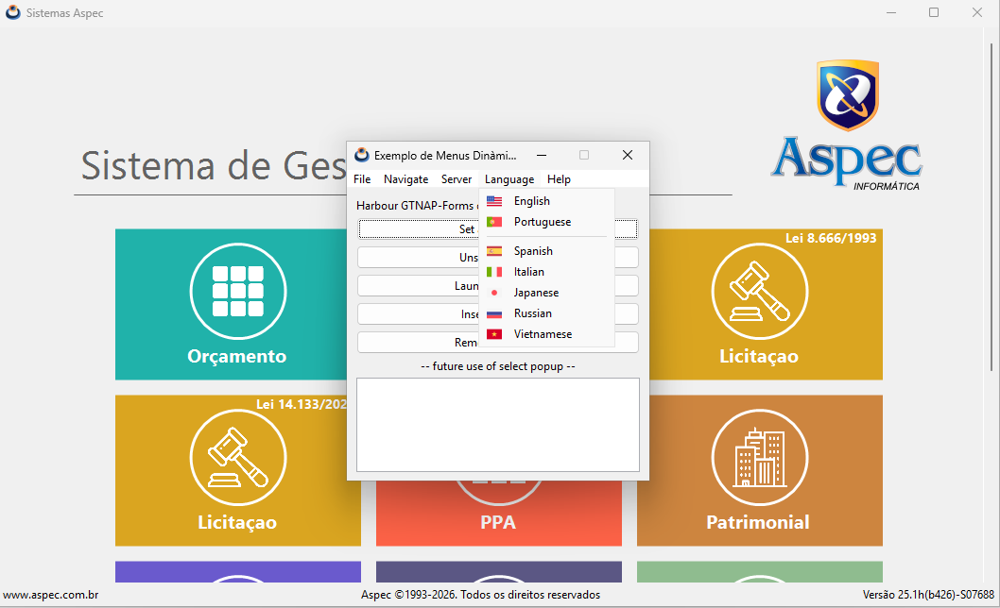

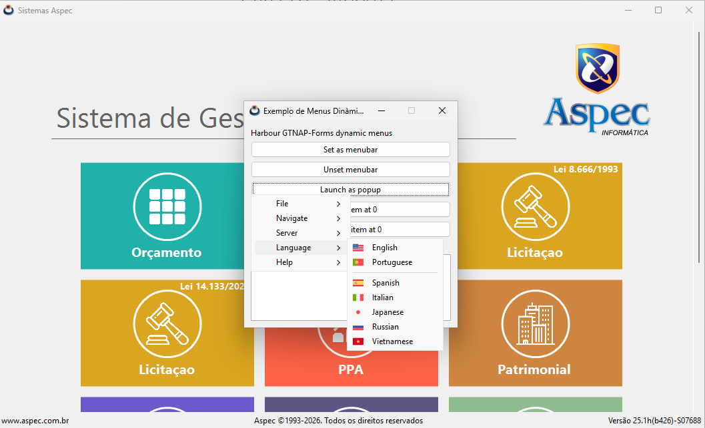

A menu can take the role of the HBNAP forms main menu (menubar) or be launched as a context menu (popup-menu). A menu is made up of several options (MenuItems). A MenuItem, in turn, can contain a submenu, forming a tree-like hierarchy. The API is quite intuitive and is based on four functions that allow you to create menu trees recursively.

```
// Create the menu containers
LOCAL O_MAINMENU := HBNAP_MENU_CREATE()
LOCAL O_FILEMENU := HBNAP_MENU_CREATE()

// Create the menu items
LOCAL O_MAINITEM1 := HBNAP_MENUITEM_CREATE("File", NIL, NIL)
LOCAL O_FILEITEM1 := HBNAP_MENUITEM_CREATE("Open", DIRET_FORMS() + "icons/open.png", {| O_ITEM | ITEM_CLICKED(O_FORM, O_ITEM)})
LOCAL O_FILEITEM2 := HBNAP_MENUITEM_CREATE("Save", DIRET_FORMS() + "icons/save.png", {| O_ITEM | ITEM_CLICKED(O_FORM, O_ITEM)})
LOCAL O_FILEITEM3 := HBNAP_MENUITEM_CREATE("Exit", DIRET_FORMS() + "icons/exit.png", {| O_ITEM | ITEM_CLICKED(O_FORM, O_ITEM)})

// Add items to menu
HBNAP_MENU_ADD_ITEM(O_FILEMENU, O_FILEITEM1)
HBNAP_MENU_ADD_ITEM(O_FILEMENU, O_FILEITEM2)
HBNAP_MENU_ADD_ITEM(O_FILEMENU, HBNAP_MENUITEM_SEPARATOR())
HBNAP_MENU_ADD_ITEM(O_FILEMENU, O_FILEITEM3)

// Recursion: Add a submenu to an item
HBNAP_MENUITEM_SUBMENU(O_MAINITEM1, O_FILEMENU)

// Add a item with submenu to a main menu
HBNAP_MENU_ADD_ITEM(O_MAINMENU, O_MAINITEM1)
```

## UTF8 based

HBNAP uses the **UTF8 format** throughout its API. We must be careful to save all source code files that contain texts in this format. NAppGUI Designer also uses UTF8 internally.

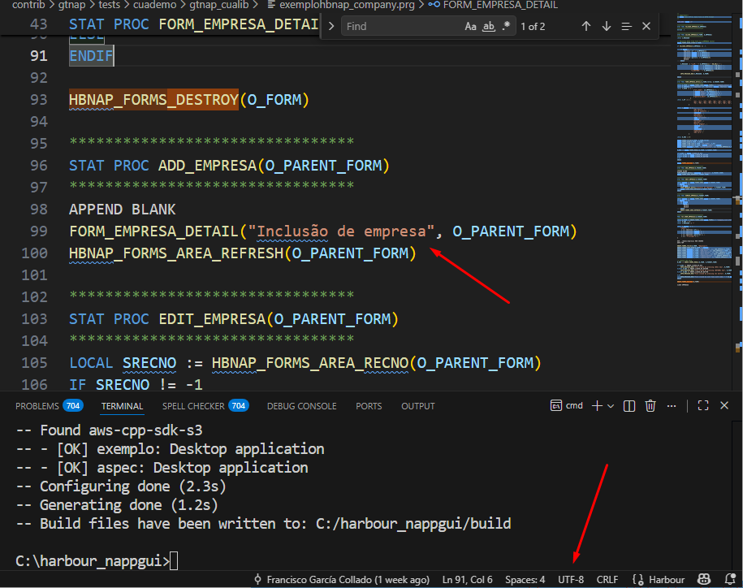

## Runtime connection

The runtime interaction between the form, loaded via a `*.nfm` file, and the Harbour code will be done through the widget cell name. For example, to change the text of a `Label` widget:

```
HBNAP_FORMS_SET_TEXT(O_MAINWINDOW, "version", "New Versão 28.1h(b765)-S09999")
```

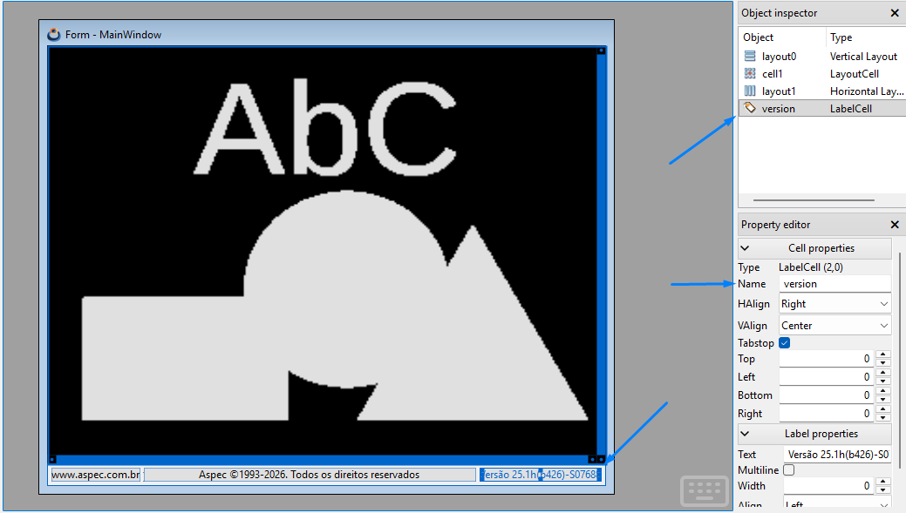

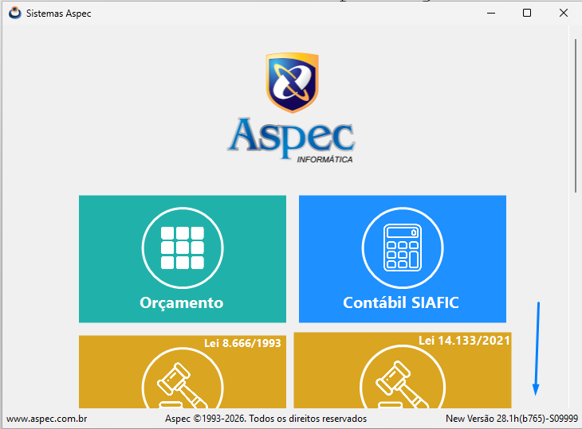

## Data binding

For the form to be truly practical, we must be able to "map" variables in Harbour with widgets within the form (for example EditBox). As we have already indicated, this binding will be done through the cell identifiers (Cell Name) and the `HBNAP_FORMS_BIND()` function

```
LOCAL O_EMPRESA := { empresas->uf, empresas->codcid, empresas->cidade, empresas->codent, empresas->gestora }
LOCAL V_BIND := { ;
                    {"uf_combo", @O_EMPRESA[1] }, ;
                    {"codcid_edit", @O_EMPRESA[2] }, ;
                    {"cidade_combo", @O_EMPRESA[3] }, ;
                    {"codent_edit", @O_EMPRESA[4] }, ;
                    {"gestora_edit", @O_EMPRESA[5] } ;

// Maps O_EMPRESA vector to form widgets
HBNAP_FORMS_BIND(O_FORM, V_BIND)
...
// Recovery data from form to O_EMPRESA vector
HBNAP_FORMS_BIND_STORE(O_FORM)
```

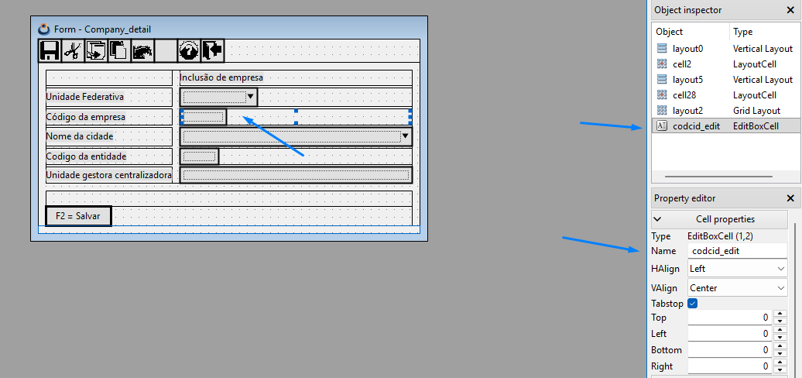

## Area binding (TableView)

In addition to binding widgets with variables, we can bind a database with a data view (TableView). To do this we will use the `HBNAP_FORMS_AREA_BIND()` function.

```
LOCAL V_DBBIND := { ;
    "table", ;
     { {|| empresas->uf} }, ;
     { {|| empresas->codcid} }, ;
     { {|| empresas->cidade} }, ;
     { {|| empresas->gestora} }, ;
     { {|| "Principal"} } ;
}

USE ../dados/empresas NEW SHARED
GOTO TOP

HBNAP_FORMS_AREA_BIND(O_FORM, V_DBBIND)
```

The first value of the `V_DBBIND` vector will be the `cellName` that contains the `TableView` control. The subsequent values ??will correspond to the code blocks that will be executed for each column of the table, for each record in the database.

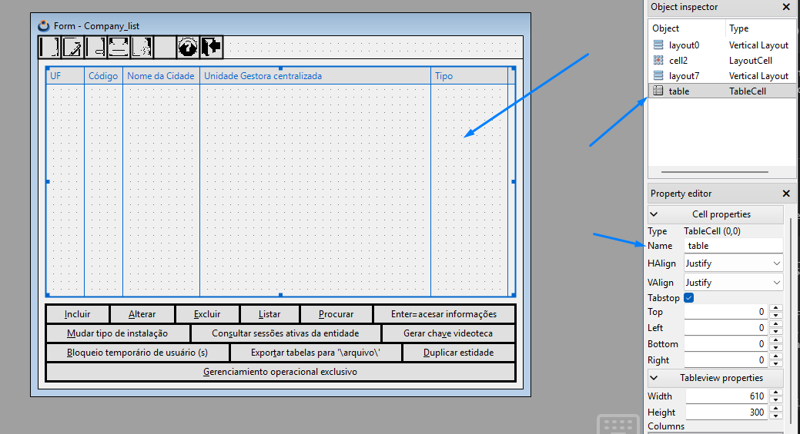

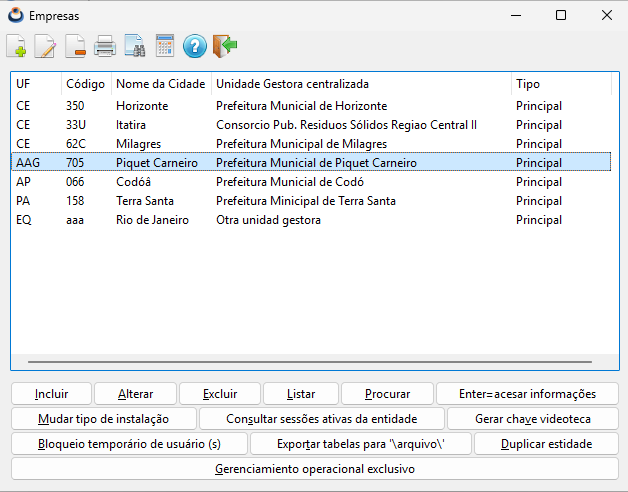

## HBNAP API Reference

### HBNAP_FORMS_LOAD

Loads a form from a `*.nfm` file on disk. These types of files are created using NAppGUI Designer.

```
LOCAL O_FORM := HBNAP_FORMS_LOAD(DIRET_FORMS() + "Company_detail.nfm", DIRET_FORMS(), hb_bitOr(HBNAP_FORMS_RESIZABLE, HBNAP_FORMS_CLOSE_ON_ESC, HBNAP_FORMS_CLOSE_ON_RETURN))

PAR1: Path to the file containing the form.
PAR2: Base path for the form resources.
PAR3: hb_bitOr() with form creation flags.
RET: Form object.

# Creation flags (in hbnap.ch)
HBNAP_FORMS_RESIZABLE       The form will be resizable. Will be ignored if HBNAP_FORMS_EMBEDDED_PANEL is set.
HBNAP_FORMS_CLOSE_ON_ESC    The form can be closed with [ESC] key. Will be ignored if HBNAP_FORMS_EMBEDDED_PANEL is set.
HBNAP_FORMS_CLOSE_ON_RETURN The form can be closed with [RETURN] key. Will be ignored if HBNAP_FORMS_EMBEDDED_PANEL is set.
HBNAP_FORMS_EMBEDDED_PANEL  The form is an inner panel (embedded), not a top-level window.
```

### HBNAP_FORMS_DESTROY

Destroys a form, when it is no longer needed. All associated resources and memory will be freed.

```
HBNAP_FORMS_DESTROY(O_FORM)

PAR1: Form object.
```

### HBNAP_FORMS_TITLE

Set a title for the form window.

```
HBNAP_FORMS_TITLE(O_FORM, "Inclusão de empresa")

PAR1: Form object.
PAR2: Text string in UTF8 with the title.
```

### HBNAP_FORMS_SET_TEXT

Sets the text for a widget within the form. Access to the widget is done using the cell identifier. The widgets that respond to this function are:

- Push Button
- Check Box
- Radio Button
- Label
- Edit Box
- Combo Box
- Text View

```
HBNAP_FORMS_SET_TEXT(O_MAINWINDOW, "version", "Versão 25.1h(b426)-S07688")

PAR1: Form object.
PAR2: Widget cell name.
PAR3: Text string in UTF8.
```

### HBNAP_FORMS_SET_INT

Sets a integer value for a widget within the form. Access to the widget is done using the cell identifier. The widgets that respond to this function are:

- Label (will display the value)
- Edit Box (will show the value for edit)
- PopUp (will select the item in 'value' position)
- List Box (will select the item in 'value' position)
- Tab Control (will select the tab in 'value' position)

```
HBNAP_FORMS_SET_INT(O_MAINWINDOW, "popup_1", 3)

PAR1: Form object.
PAR2: Widget cell name.
PAR3: Integer value
```

### HBNAP_FORMS_INSERT_TEXT

Add text to the end of a widget, without deleting previous text. Access to the widget is done using the cell identifier. The widgets that respond to this function are:

- Text View

```
HBNAP_FORMS_INSERT_TEXT(O_FORM, "textview", "And this text will be added at the end")

PAR1: Form object.
PAR2: Widget cell name.
PAR3: Text string in UTF8.
```

### HBNAP_FORMS_GET_INT

Gets the integer value associated with the state of a widget.
The widgets that respond to this function are:

- Edit Box (the text will be converted to integer)
- PopUp (the value of selected item)
- List Box (the value of selected item)
- Tab Control (the value of selected tab)

```
N_VALUE := HBNAP_FORMS_GET_INT(O_FORM, "popup_1")

PAR1: Form object.
PAR2: Widget cell name.
RET: The integer value, or -1 if error.
```

### HBNAP_FORMS_EMBED

Embeds (swaps) an interior panel into a form at run time.

```
O_EMBEDDED := HBNAP_FORMS_LOAD(DIRET_FORMS() + "InnerPanel.nfm", DIRET_FORMS(), HBNAP_FORMS_EMBEDDED_PANEL)
N_VALUE := HBNAP_FORMS_EMBEB(O_FORM, O_EMBEDDED, "runtime_panel")

PAR1: Form object.
PAR2: Inner (embedded) form object. It must be created with HBNAP_FORMS_EMBEDDED_PANEL flag.
PAR3: Widget cell name. The widget MUST be a Panel widget.
RET: .T. if success. .F. if the panel change fails.
```

### HBNAP_FORMS_BIND

Binds a vector of pairs (id-variable) to the form. See [Data Binding](#data-binding).

```
LOCAL O_EMPRESA := { empresas->uf, empresas->codcid, empresas->cidade, empresas->codent, empresas->gestora }
LOCAL V_BIND := { ;
                    {"uf_combo", @O_EMPRESA[1] }, ;
                    {"codcid_edit", @O_EMPRESA[2] }, ;
                    {"cidade_combo", @O_EMPRESA[3] }, ;
                    {"codent_edit", @O_EMPRESA[4] }, ;
                    {"gestora_edit", @O_EMPRESA[5] } ;

HBNAP_FORMS_BIND(O_FORM, V_BIND)

PAR1: Form object.
PAR2: Pair vector (cellId-variable)
```

### HBNAP_FORMS_BIND_STORE

For those variables passed by reference to `HBNAP_FORMS_BIND()`, this function updates the value of the variable with the contents of the widget.

```
HBNAP_FORMS_BIND_STORE(O_FORM)

PAR1: Form object.
```

### HBNAP_FORMS_AREA_BIND

Links a `TableView` control on the form to a Harbour database. See [Area Binding](#area-binding-tableview).

```
LOCAL V_DBBIND := { ;
    "table", ;
     { {|| empresas->uf} }, ;
     { {|| empresas->codcid} }, ;
     { {|| empresas->cidade} }, ;
     { {|| empresas->gestora} }, ;
     { {|| "Principal"} } ;
}

USE ../dados/empresas NEW SHARED
GOTO TOP

HBNAP_FORMS_AREA_BIND(O_FORM, V_DBBIND)

PAR1: Form object.
PAR2: Vector. First element is the TableView cellName. The other elements will contain the code block to execute on each column of the table.
```

### HBNAP_FORMS_AREA_REFRESH

Refreshes the `TableView` control linked to a database in Harbour. This function must be called after having made changes from Harbour code, so that these are reflected in the table.

```
HBNAP_FORMS_AREA_REFRESH(O_FORM)

PAR1: Form object.
```

### HBNAP_FORMS_AREA_RECNO

Gets the record number (`recno`) currently selected in a `TableView` linked to a database.

```
LOCAL SRECNO := HBNAP_FORMS_AREA_RECNO(O_PARENT_FORM)
IF SRECNO != -1
    GO SRECNO
    FORM_EMPRESA_DETAIL("Alterar de empresa", O_PARENT_FORM)
    HBNAP_FORMS_AREA_REFRESH(O_PARENT_FORM)
ENDIF

PAR1: Form object.
RET: The current selected recno.
```

### HBNAP_FORMS_ITEM_LIST

Sets a list of values ??in those widgets that support lists of items. These are:

- Pop Up
- Combo Box
- List Box

```
LOCAL C_CIDADE := { ;
                    "São Paulo", ;
                    "Rio de Janeiro", ;
                    "Brasília", ;
                    "Salvador", ;
                    "Fortaleza", ;
                    "Belo Horizonte", ;
                    "Manaus", ;
                    "Curitiba", ;
                    "Recife", ;
                    "Porto Alegre", ;
                    "Goiânia", ;
                    "Belém", ;
                    "Guarulhos", ;
                    "Campinas", ;
                    "São Luís" ;
              }

HBNAP_FORMS_ITEM_LIST(O_FORM, "cidade_combo", C_CIDADE)

PAR1: Form object.
PAR2: Widget cell name.
PAR3: Vector with the list of values ??(in UTF8).
```
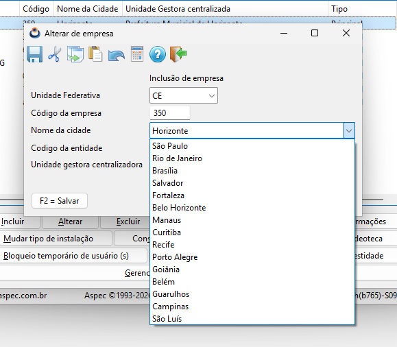

### HBNAP_FORMS_ONCLICK

Establece un manejador de evento, en el caso de que se pulse un botón del formulario.

```
HBNAP_FORMS_ONCLICK(O_FORM, "add_button", {|| ADD_EMPRESA(O_FORM) })

PAR1: Form object.
PAR2: Widget (button) cell name.
PAR3: Code block to execute when the button is pressed.
```

### HBNAP_FORMS_MAXIMIZE

Maximizes a form so that it fills the entire screen area. It is only applicable to those forms created with the `HBNAP_FORMS_RESIZABLE` flag. If the form is not already visible, it will be displayed maximized when activated.

```
HBNAP_FORMS_MAXIMIZE(O_MAINWINDOW)

PAR1: Form object.
```

### HBNAP_FORMS_SHOW

Activate the form as the main application window. It is not recommended to use this function if there are already open windows. For those cases use `HBNAP_FORMS_MODAL()`.

```
HBNAP_FORMS_SHOW(O_MAINWINDOW, {|| MAIN_WINDOW_CLOSE() })

PAR1: Form object.
PAR2: Code block to be executed when the window close button [X] is pressed.
```

### HBNAP_FORMS_MODAL

Run a form in modal mode. The previous form (parent) will be locked until this form is closed.

```
N_RES := HBNAP_FORMS_MODAL(O_FORM, O_PARENT_FORM)

IF N_RES == HBNAP_CLOSED_BY_ESC
ELSEIF N_RES == HBNAP_CLOSED_BY_RETURN
ELSEIF N_RES == HBNAP_CLOSED_BY_BUTTON
ELSE
ENDIF

PAR1: Form object.
PAR2: Parent form object.
RET: Integer with the modal execution result.

# Return values (in hbnap.ch)
HBNAP_CLOSED_BY_ESC     Form closed by [ESC] key.
HBNAP_CLOSED_BY_RETURN  Form closed by [RETURN] key.
HBNAP_CLOSED_BY_BUTTON  Form closed by [X] button in title bar.
..OTHER..               Form close programmatically by HBNAP_FORMS_STOP_MODAL()
```

### HBNAP_FORMS_MODAL_GTNAP

Same as `HBNAP_FORMS_MODAL()` but considering that the parent window is a GTNAP window (semigraphic mode). These windows are controlled internally by GTNAP and do not have an object accessible from Harbour.

```
N_RES := HBNAP_FORMS_MODAL_GTNAP(O_MAINWINDOW)

PAR1: Form object.
RET: Integer with the modal execution result. Same as HBNAP_FORMS_MODAL().
```

### HBNAP_FORMS_STOP_MODAL

Detiene el ciclo modal de un formulario lanzado previamente con `HBNAP_FORMS_MODAL()` o `HBNAP_FORMS_MODAL_GTNAP()`. Se pasará el valor entero a devolver por estas funciones.

> **Important:** Stopping a modal form does not mean destroying it. We can launch it several times and we will have to call `HBNAP_FORMS_DESTROY()` when it is no longer necessary.

```
// Stop the form when press a form button
HBNAP_FORMS_ONCLICK(O_MESSAGE, "button", {|| HBNAP_FORMS_STOP_MODAL(O_MESSAGE, 100)})

PAR1: Form object.
PAR2: Integer value that will be returned by HBNAP_FORMS_MODAL().
```

### HBNAP_FORMS_CONTROL_FRAME

Returns the frame (position and size) of a form widget.

```
// Get the button frame in screen coordinates {x, y, width, height}
LOCAL V_FRAME := HBNAP_FORMS_CONTROL_FRAME(O_FORM, "button_launchpopup")

PAR1: Form object.
PAR2: Widget cell name.
RET: Widget frame
    - RET[1] X pos in screen coordinates.
    - RET[2] Y pos in screen coordinates.
    - RET[3] Widget width.
    - RET[4] Widget height.
```

### HBNAP_FORMS_UPDATE

Actualiza la composición del formulario, en caso de que se haya realizado alguna opción que modifique su estructura. Por ejemplo, añadir una barra de menú.

```
HBNAP_FORMS_UPDATE(O_FORM)

PAR1: Form object.
```

### HBNAP_FORMS_MAIN_COVER

High-level function that displays an interactive options menu, within a `Scroll View` widget.

For each item we will provide this data:
- Title (in UTF8).
- Path to the icon.
- Background color (in HTML format).
- Subtitle (in UTF8).
- New? .T. or .F.
- Code block to be executed if the option is pressed.

```
LOCAL V_COVER := { ;
    { "Orçamento", DIRET_FORMS() + "images/main/grid.png", "#20B2AA", "", .F., { || BUDGET_START() }}, ;
    { "Contábil SIAFIC", DIRET_FORMS() + "images/main/calc.png", "#1E90FF", "", .F., { || ACCOUNTING_START() }}, ;
    { "Licitaçao", DIRET_FORMS() + "images/main/auction.png", "#DAA520", "Lei 8.666/1993", .F., { || BIDDING_START() }}, ;
    { "Licitaçao", DIRET_FORMS() + "images/main/auction.png", "#DAA520", "Lei 14.133/2021", .T., { || BIDDING_NEW_START() }}, ;
    { "PPA", DIRET_FORMS() + "images/main/trend.png", "#FF6347", "", .F., { || TREND_START() }}, ;
    { "Patrimonial", DIRET_FORMS() + "images/main/skyline.png", "#CD853F", "", .F., { || ASSETS_START() }}, ;
    { "Almoxarifado", DIRET_FORMS() + "images/main/cubes.png", "#6A5ACD", "", .F., { || WAREHOUSE_START() }}, ;
    { "Frota", DIRET_FORMS() + "images/main/fleet.png", "#5B5784", "", .F., { || FLEET_START() }}, ;
    { "Doações", DIRET_FORMS() + "images/main/carry.png", "#8FBC8F", "", .F., { || DONATIONS_START() }}, ;
    { "Backup", DIRET_FORMS() + "images/main/backup.png", "#C0C0C0", "", .F., { || BACKUP_START() }} ;
}

HBNAP_FORMS_MAIN_COVER(O_MAINWINDOW, "canvas", "Sistema de Gestão Pública", DIRET_FORMS() + "images/logo_aspec.png", V_COVER)

PAR1: Form object.
PAR2: Scroll View cell name.
PAR3: Main menu title.
PAR4: Menu main image.
PAR5: Item list.
```

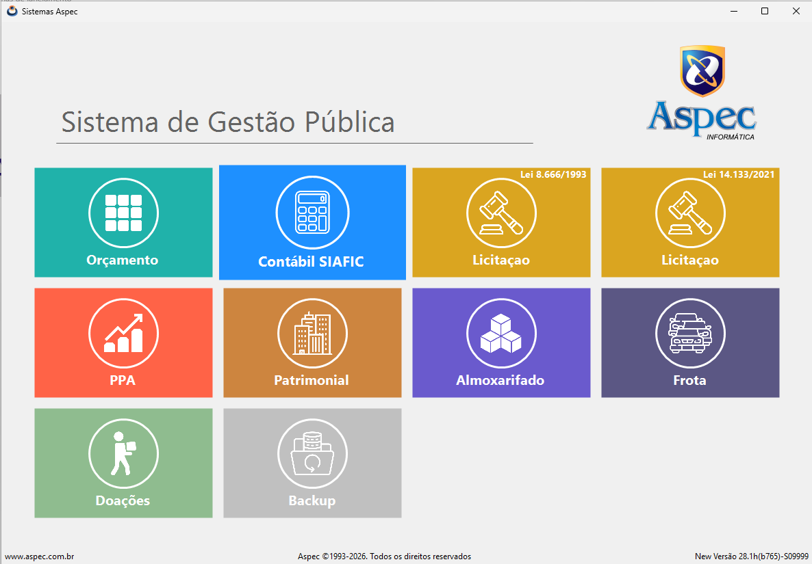

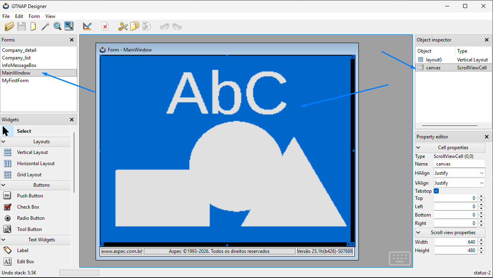

## HBNAP Menu API Reference

### HBNAP_MENU_CREATE

Create a new empty menu.

```
LOCAL O_MENU := HBNAP_MENU_CREATE()

RET: The menu object.
```

### HBNAP_MENU_DESTROY

Destroy the menu. All items and submenus will be recursively destroyed. The destructor only needs to be called with the main menu.

```
HBNAP_MENU_DESTROY(O_MENU)

PAR1: Menu object to destroy.
```

### HBNAP_MENU_ADD_ITEM

Adds a new MenuItem at the end of menu.

```
HBNAP_MENU_ADD_ITEM(O_MENU, O_ITEM)

PAR1: Menu object.
PAR2: Item object.
```

### HBNAP_MENU_INS_ITEM

Inserts a new MenuItem at an arbitrary position in the menu.

```
HBNAP_MENU_INS_ITEM(O_MENU, 2, O_ITEM)

PAR1: Menu object.
PAR2: Position (1 = First).
PAR3: Item object.
```

### HBNAP_MENU_DEL_ITEM

Removes a MenuItem from its position. The item and all associated submenus will be destroyed.

```
HBNAP_MENU_DEL_ITEM(O_MENU, 2)

PAR1: Menu object.
PAR2: Position (1 = First).
```

### HBNAP_MENU_COUNT

Returns the number of menu items.

```
LOCAL N_Size := HBNAP_MENU_COUNT(O_MENU)

PAR1: Menu object.
RET: The number of menu items.
```

### HBNAP_MENU_GET_ITEM

Gets a menuitem from its position.

```
LOCAL O_ITEM := HBNAP_MENU_GET_ITEM(O_MENU, 2)

PAR1: Menu object.
PAR2: Position (1 = First).
RET: The MenuItem object.
```

### HBNAP_MENU_BAR

Sets a menu as the main menu bar. An active form must be passed, since in Windows and Linux the menubars are linked to a window.

```
HBNAP_MENU_BAR(O_MENU, O_FORM)

PAR1: Menu object. If NIL, any previous menubar will be unlinked from the form.
PAR2: Parent HBNAP-Form.
```

### HBNAP_MENU_IS_MENUBAR

Returns .T. if the menu is currently set as the main menu bar.

```
LOCAL L_ISBAR := HBNAP_MENU_IS_MENUBAR(O_MENU)

PAR1: Menu object.
```

### HBNAP_MENU_POPUP

Launches a menu as a pop-up (contextual menu). The menu must NOT have the role of menubar.

```
HBNAP_MENU_POPUP(O_MENU, V_FORM, 200, 100)

PAR1: Menu object.
PAR2: Parent form.
PAR3: X coordinate of left-top corner in screen space.
PAR4: Y coordinate of left-top corner in screen space.
```

### HBNAP_MENUITEM_CREATE

Create a new MenuItem.

```
LOCAL O_OPENITEM := HBNAP_MENUITEM_CREATE("Open", "open.png", {| O_ITEM | ITEM_CLICKED(V_FORM, O_ITEM)})

PAR1: Item text in UTF8.
PAR2: Icon path. If NIL no icon will shown.
PAR3: Code block for click action. A reference to clicked item will always send to the callback.
RET: The MenuItem
```

### HBNAP_MENUITEM_SEPARATOR

Create a new separator item.

```
LOCAL O_SEPITEM := HBNAP_MENUITEM_SEPARATOR()

RET: The separator MenuItem
```

### HBNAP_MENUITEM_SUBMENU

Adds a submenu to a MenuItem

```
HBNAP_MENUITEM_SUBMENU(O_ITEM, O_SUBMENU)

PAR1: The MenuItem
PAR2: The submenu to add.
```

### HBNAP_MENUITEM_GET_TEXT

Gets the current text of a menu item.

```
LOCAL C_TEXT := HBNAP_MENUITEM_GET_TEXT(O_ITEM)

PAR1: The MenuItem
RET: The current text.
```

### HBNAP_MENUITEM_GET_SUBMENU

Gets the current submenu of a menu item.

```
LOCAL O_SUBMENU := HBNAP_MENUITEM_GET_SUBMENU(O_ITEM)

PAR1: The MenuItem
RET: The current submenu.
```
